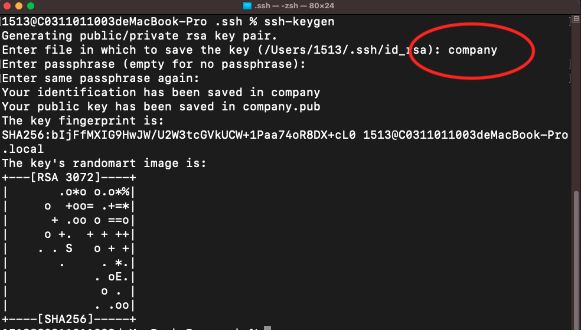
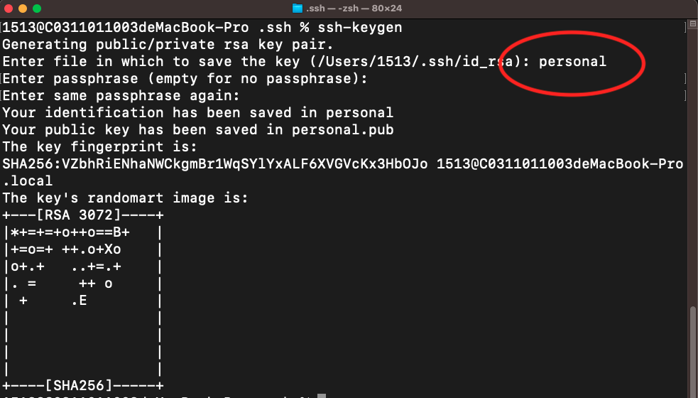
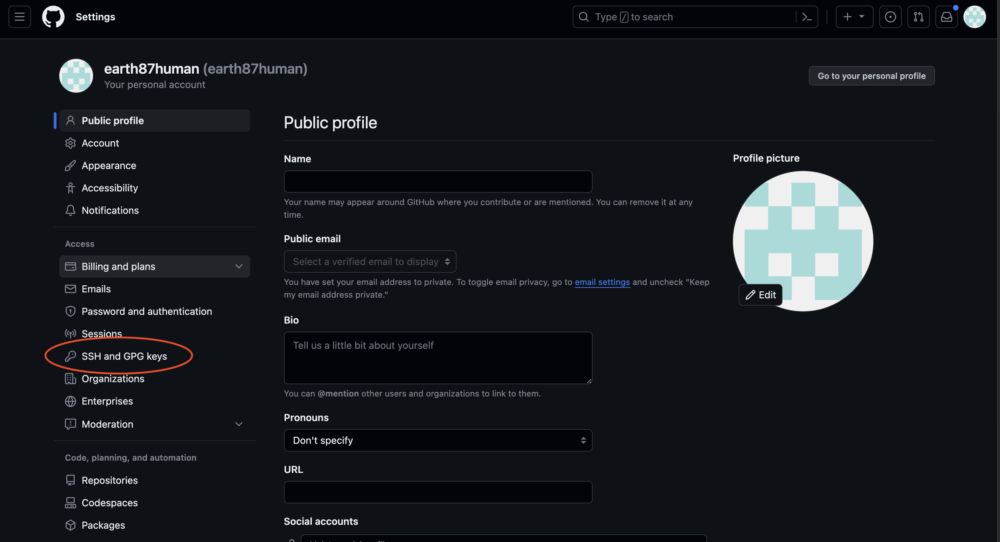
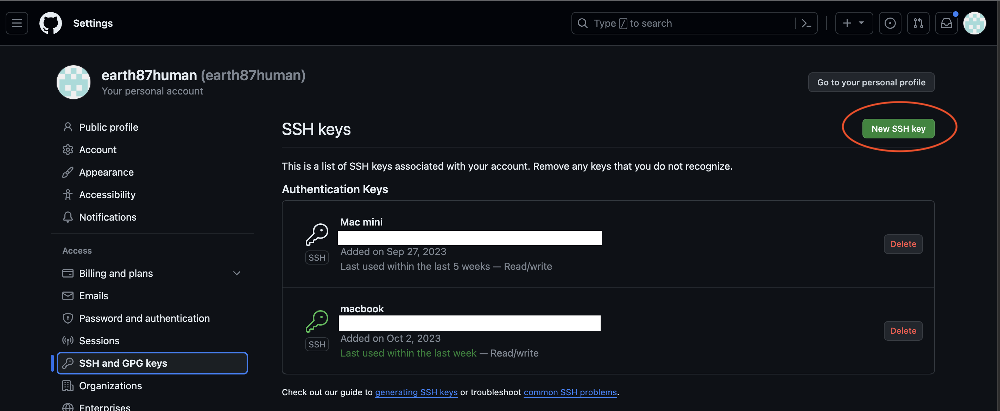
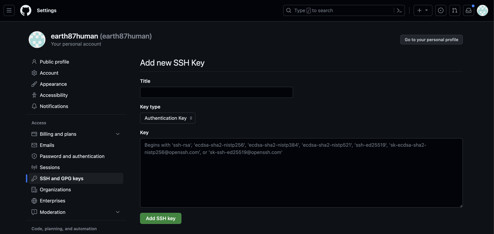
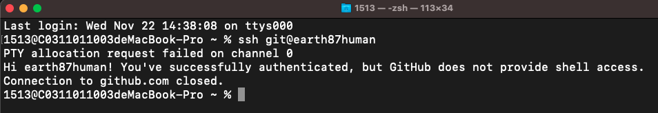

## 需求 : 

> 使用同一台主機登入兩個以上不同GitHub帳號像是(公司帳號 + 個人帳號)。

## 解決方法 : 

> 由於 Github 不允許不同帳號使用同一個 public key，  
> 需用 ssh-keygen 產兩組非對稱加密金鑰，  
> 並設置 ssh config 檔，指定ssh連線時所使用的金鑰。

## Step 1  : 產兩組非對稱加密金鑰

```c++
# 到家目錄底下 .ssh 資料夾
cd ~/.ssh

# 使用 ssh-keygen 產生兩組非對稱加密金鑰
# 一組為 company(私鑰) / company.pub(公鑰)
# 一組為 personal(私鑰) / personal.pub(公鑰)
```




## Step 2  : 將本機端公鑰存放至GitHub

```c++
cd ~/.ssh
# 將 company.pub 放到公司的GitHub帳號      
cat company.pub
# 將 personal.pub 放到個人的GitHub帳號 
cat personal.pub
```







## Step 3 : 設置 ssh config檔

```c++
# 到家目錄底下 .ssh 資料夾
cd ~/.ssh

# 設定 ssh config 檔
vim config

Host company                    # 自定義連線主機名(alias)
  Hostname github.com           # 要連線的主機
  Identityfile ~/.ssh/company   # 存放私鑰的位置
Host personal                   # 自定義連線主機名(alias) 
  Hostname github.com           # 要連線的主機
  Identityfile ~/.ssh/personal  # 存放私鑰的位置
```

## Step 4 : 測試 ssh 連線是否成功

```c++
# 測試公司Github帳號是否可以連線
ssh git@company

# 測試個人Github帳號是否可以連線
ssh git@personal
```



## Step 5 : clone 專案

```c++
# clone 公司Github帳號專案

# 將原本 github.com 改成 ssh config 檔的 Host
git clone git@company:公司Github帳號/專案名稱.git

# clone 個人Github帳號專案

# 將原本 github.com 改成 ssh config 檔的 Host
git clone git@personal:個人Github帳號/專案名稱.git
```

## 大功告成～