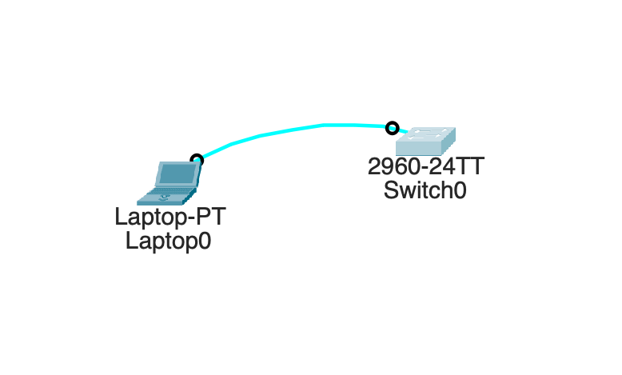
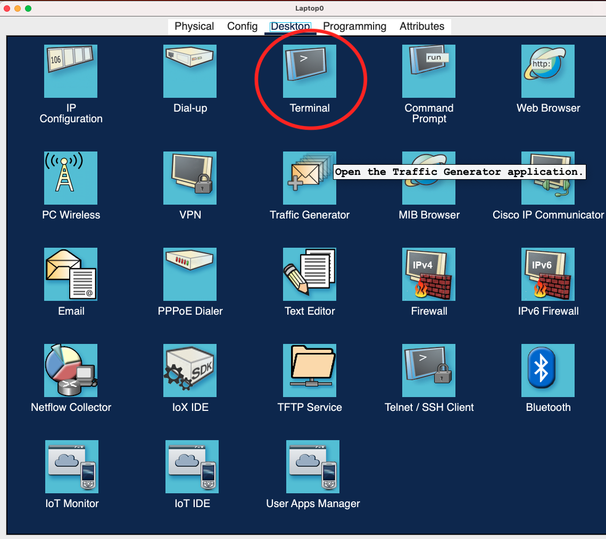
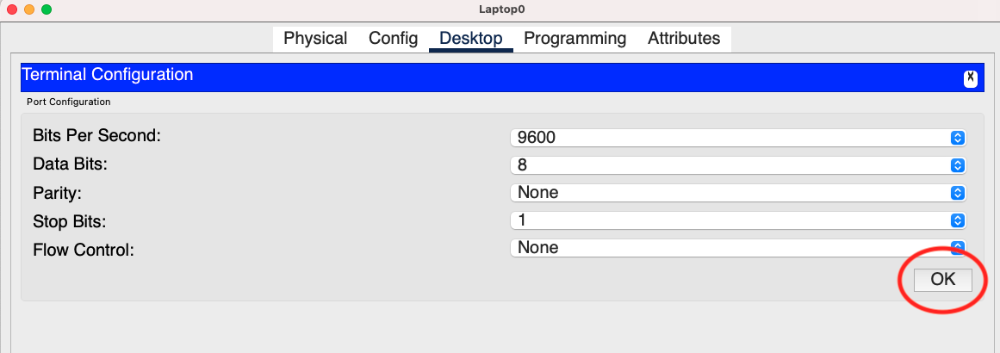
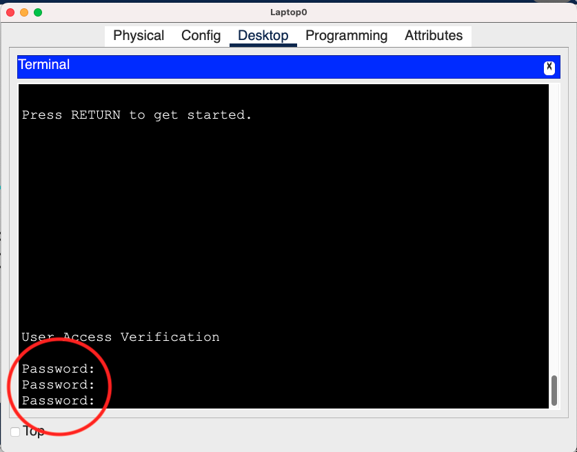
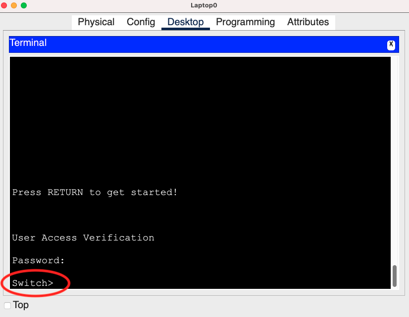

## 需求 : 

>  在 Cisco Switch 裝置設定 line console 登入密碼，防止不肖人士登入。

## Step 1  : 建立模擬環境

> 開啟 Packet Tracer 建立模擬環境，如下圖



## Step 2  : 設定密碼

> 打開 Switch CLI 設定密碼

```c++
# 進入 privileged mode
Switch> enable
# 進入 config mode
Switch# configure termianl
# 關閉 dns lookup
Switch(config)# no ip domain-lookup
# 選擇 line console 0 , switch 只有一個 console port 故選擇 0
Switch(config)# line console 0
# 設定密碼
Switch(config-line)# password earth87human
# 啟用密碼
Switch(config-line)# login
```

## Step 3  : 設定逾時自動登出

> 打開 Switch CLI 設定逾時自動登出

```c++
# 設定逾時自動登出
Switch(config-line)# exec-time 02 30  設定逾時時間為2:30
```

## Step 4  : 驗證

> 驗證 Laptop 是否可以用密碼登入 Switch 









## Step 5  : 取消登入密碼

> 打開 Switch CLI 取消登入密碼

```c++
# 取消登入密碼
Switch(Config)# line console 0
Switch(Config-line)# no password  
```

## 大功告成～