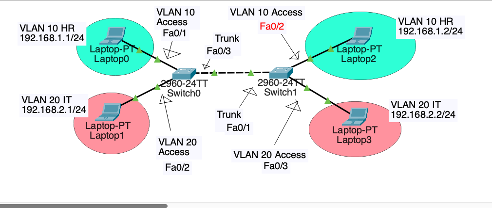
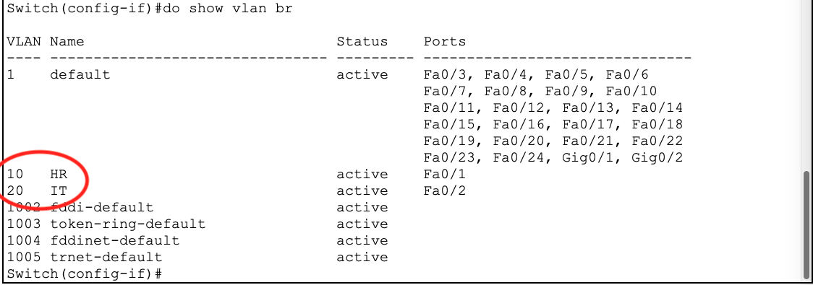
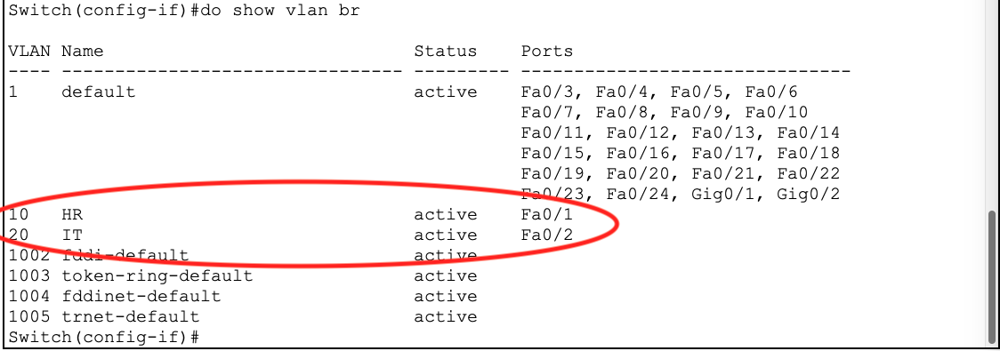
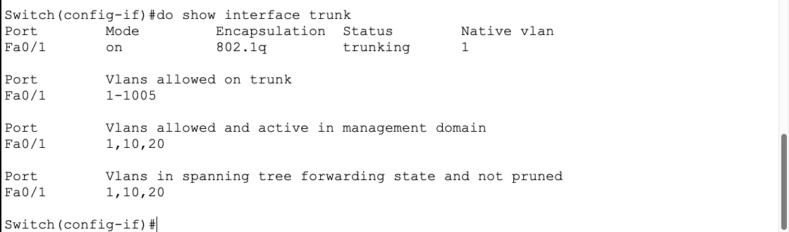
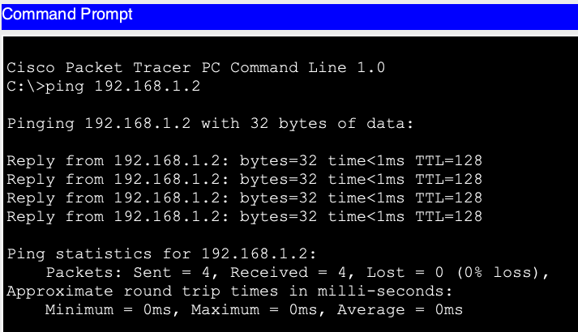

## 需求 : 

>  在 Cisco Switch 裝置設定 VLAN , 減少 Broadcast Domain 的範圍。

## Step 1  : 建立模擬環境

> 開啟 Packet Tracer 建立模擬環境，如下圖



## Step 2  : 建立 VLAN

> 進入 Switch CLI 建立 VLAN , 兩台都要設定

> 首先設置左邊那台 Switch0

```c++
# 進入 privileged mode
Switch> enable
# 進入 config mode
Switch# configure termianl
# 關閉 dns lookup
Switch(config)# no ip domain-lookup
# 建立 VLAN 10
Switch(config)# vlan 10
# 設定 VLAN 10 名稱為 HR
Switch(config-vlan)# name HR
# 建立 VLAN 20
Switch(config-vlan)# vlan 20
# 設定 VLAN 20 名稱為 IT
Switch(config-vlan)# name IT
```

> 設置右邊那台 Switch1

```c++
# 進入 privileged mode
Switch> enable
# 進入 config mode
Switch# configure termianl
# 關閉 dns lookup
Switch(config)# no ip domain-lookup
# 建立 VLAN 10
Switch(config)# vlan 10
# 設定 VLAN 10 名稱為 HR
Switch(config-vlan)# name HR
# 建立 VLAN 20
Switch(config-vlan)# vlan 20
# 設定 VLAN 20 名稱為 IT
Switch(config-vlan)# name IT
```

## Step 3  : 驗證 VLAN

> 驗證 VLAN 是否建立成功

```c++
# 在 config mode 要加 do
Switch(config-vlan)# do show vlan brief
```



## Step 4  : 建立 access port

> 在連接終端設備的端口設置 accss port

> 首先設置左邊那台 Switch0

```c++
# 進入 privileged mode
Switch> enable
# 進入 config mode
Switch# configure termianl
# 選擇 fa0/1 端口
Switch(config)# interface fa0/1
# 將 fa0/1 端口設置成 access port
Switch(config-if)# switchport mode access
# 將 fa0/1 端口和 VLAN 10 綁定
Switch(config-if)# switchport access vlan 10
# 選擇 fa0/2 端口
Switch(config-if)# interface fa0/2
# 將 fa0/2 端口設置成 access port
Switch(config-if)# switchport mode access
# 將 fa0/2 端口和 VLAN 20 綁定
Switch(config-if)# switchport access vlan 20
```

> 設置右邊那台 Switch1

```c++
# 進入 privileged mode
Switch> enable
# 進入 config mode
Switch# configure termianl
# 選擇 fa0/2 端口
Switch(config)# interface fa0/2
# 將 fa0/2 端口設置成 access port
Switch(config-if)# switchport mode access
# 將 fa0/2 端口和 VLAN 10 綁定
Switch(config-if)# switchport access vlan 10
# 選擇 fa0/3 端口
Switch(config-if)# interface fa0/3
# 將 fa0/3 端口設置成 access port
Switch(config-if)# switchport mode access
# 將 fa0/3 端口和 VLAN 20 綁定
Switch(config-if)# switchport access vlan 20
```

## Step 5  : 驗證 access port

> 驗證 access port 是否建立成功

```c++
# 在 config mode 要加 do
Switch(config-if)# do show vlan brief
```



## Step 6  : 建立 trunk port

> 首先設置左邊那台 Switch0

```c++
# 進入 privileged mode
Switch> enable
# 進入 config mode
Switch# configure termianl
# 選擇 fa0/3 端口
Switch(config)# interface fa0/3
# 將 fa0/3 端口設置成 trunk port
Switch(config-if)# switchport mode trunk
```

> 設置右邊那台 Switch1

```c++
# 進入 privileged mode
Switch> enable
# 進入 config mode
Switch# configure termianl
# 選擇 fa0/1 端口
Switch(config)# interface fa0/1
# 將 fa0/1 端口設置成 trunk port
Switch(config-if)# switchport mode trunk
```

## Step 7  : 驗證 trunk port

> 驗證 trunk port 是否建立成功

```c++
# 在 config mode 要加 do
Switch(config-if)# do show interface trunk
```



## Step 8  : 驗證是否可以通訊

> 進入 Laptop0 (192.168.1.1/24) CLI ping 同一 VLAN 下的機器

